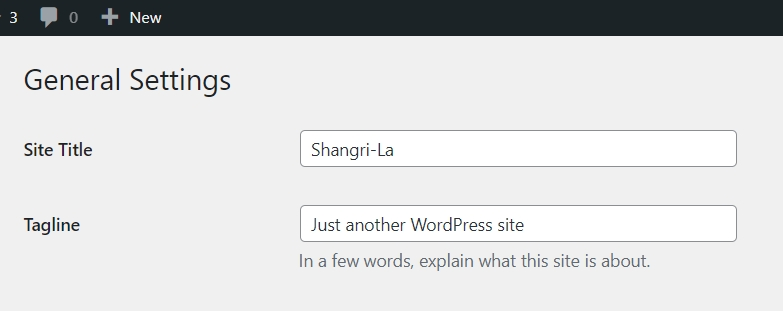
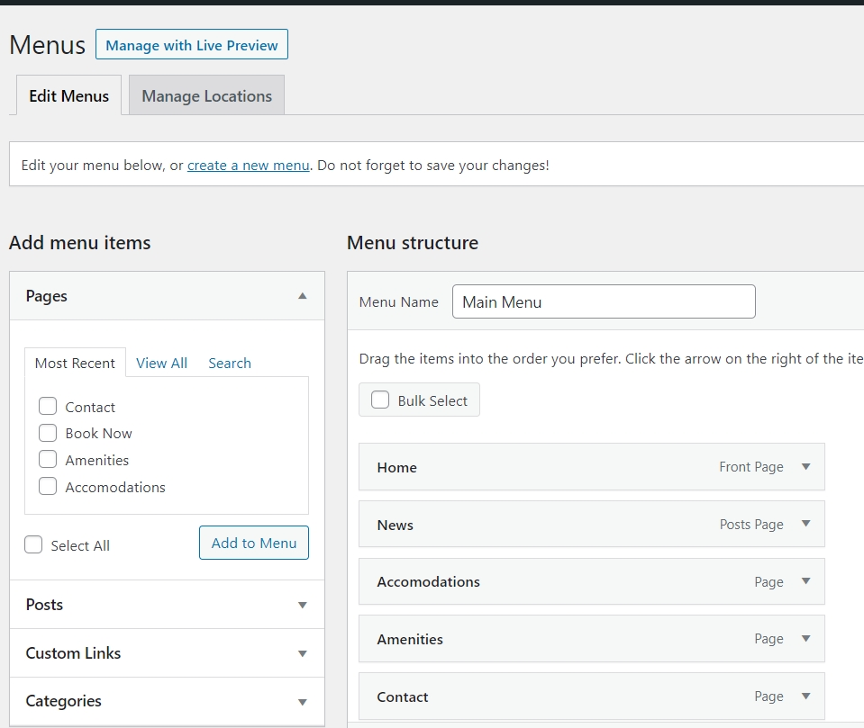
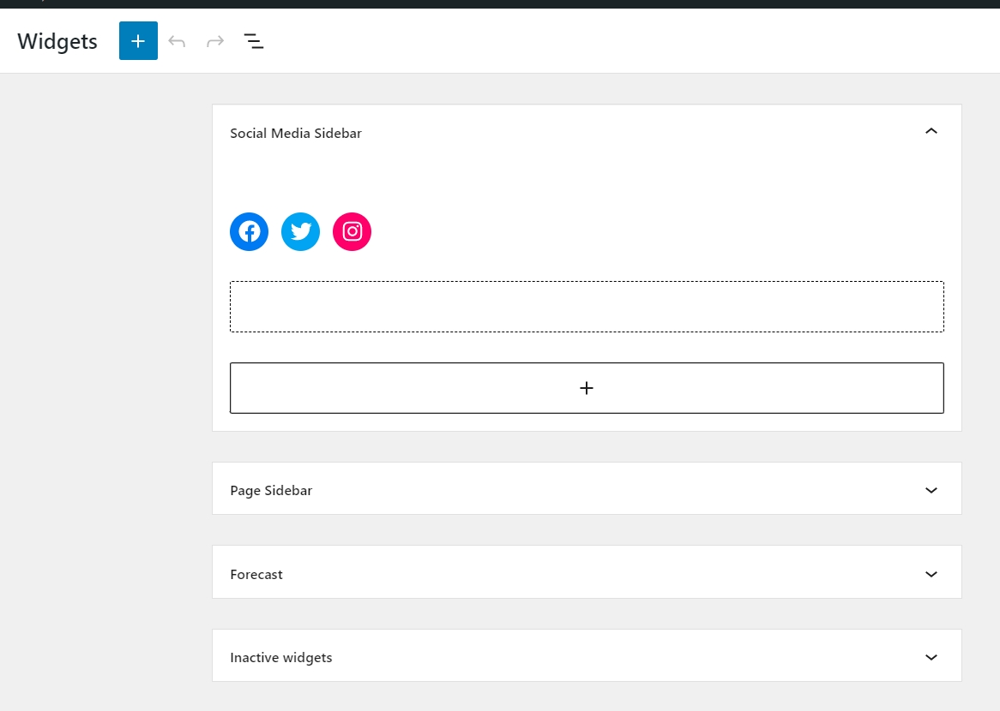

[Mandarin version](README.zh-TW.md)
# WordPress Theme Study Note

This is a study note for SAIT MMDA324 Wordpress theme class.
> all the "dashboard" are refering to WordPress backend dashboard.

## Update

🆕Comments

## Table of contents

- [WordPress Theme](#theme)
  - [Hierarchy](#hierarchy)
  - [Templates](#templates)
- [Elements](#elements)
  - [Link file](#head)
  - [h1](#h1)
  - [Menu](#menu)
  - [Sidebar](#sidebar)
  - [Comments](#comments)
- [Author](#author)

## WordPress Templates

### Hierarchy

The further to the right, the more general
The further to the left, the more specific


[Source](https://developer.wordpress.org/)

### Templates

The order below is the recommended file creating order. **the name must be named according to the regulations.**
** this mark means it is a block element, not a page, you need to use the include or get function to put in a page in order to see them.

- style.css -> The general CSS, the theme information should be written in it, other CSS stylesheets can be created separately according to different templates
- functions.php -> You have to write the funciton so that you can see features in backend(dashboard)
- index.php -> The most general page, it is the last fallback option. (the default place to put blog post is also here)
- header.php / footer.php -> The reusable components**
- page.php -> The pages that is **not post**
- single.php -> The single post
- sidebar.php -> The place that we activate widgets, all sidebar can share this file**
- archive.php -> Archive pages, the default catagorize them by months
- comments.php -> The comments and comment form components**
- searchform.php -> The search bar**
- search.php -> The search result page

## First Step

**You need to name your theme in order to see them in dashboard**

```css
@import url('Remember to import your font at the first line!');
/* 
Theme Name: Client Name 2022
Author: Your Name
Version: 0.1.0
Author URI: https://www.sample.com/
Description: The theme we built in MMDA 324 Web Communication 3 (Fall 2022)
 */
 ```

## Elements

### Link file

How to link CSS files to WordPress?

1. First add the link function to functions.php
(see details at functions.php line 3)

```php
add_theme_support('html5', array('comment-list', 'comment-form', 'search-form', 'gallery', 'caption', 'style', 'script'));
add_theme_support('title-tag');
```

2. Add all the CSS you need to the sequence. (The function get_stylesheet_uri() is used to automatically locate the path to the file style.css)
(see details at functions.php line 6)
```php
function linked_assets()
{
    wp_enqueue_style('main', get_stylesheet_uri());
    if (is_page()) {
        wp_enqueue_style('page-styles', get_template_directory_uri() . '/page.css');
    } else if (is_single()) {
        wp_enqueue_style('page-styles', get_template_directory_uri() . '/single.css');
    }
}
```

3. Activate the function we made
(see details at functions.php line 16)

```php
add_action('wp_enqueue_scripts', 'linked_assets');
```

4. Finally, add wp_head() to the <head> tag
(see details at header.php line 7)
```php
<head>
    <meta charset="utf-8">
    <meta name="viewport" content="width=device-width, initial-scale=1">
    <?php wp_head(); ?>
</head>
```


### h1

#### Clickable logo 
Use <h1> and <a> to wrap up the logo image, here is an example
(see details at header.php line 12)

```php
<h1>
<a href="<?php echo get_home_url(); ?>">
    /images/web-communicaitons-logo.svg" alt="<?php bloginfo('name'); ?>">
</a>
</h1>
```
#### blog_info()

It is the meta data (basic info) of WordPress, you can change them in the dashboard setting > general

- bloginfo('name') >> Website Title
- bloginfo('description') >> Tagline

### Menu

Menu is the stuff that usually appears in the nav, here are the steps

1. Create the menus you neeed in functions.php (see details at line 19)
```php
function my_menus()
{
    register_nav_menu('header-menu', 'Main Menu (Header)');
    register_nav_menu('mobile-menu', 'Mobile Menu (Header)');
}
//Syntax register_nav_menu('Give id for html', 'Give a name to see in dashboard');
```

2. Activate the function we made (see details at functions.php line 24)
```php
add_action('after_setup_theme', 'my_menus');
// The 'my_menus' here is the function name we just made
```

3. Setting corresponding menu in dashboard
> Dashboard > Appearance > Menus


4. Paste the menu at the place you wish
(see details and conditions at header.php line 20)

```php
wp_nav_menu(array(
                'theme_location' => 'header-menu',
                'container' => 'nav',
                'container_id' => 'main-nav'
            ));
// Syntax array('theme_location' => 'The id we register','container' => 'the tag wrap with','container_id' => 'give wrapper a tag')
```


### Sidebar
**Sidebar === Widgets**
 We can put stuffs such as social icons, latest post, calendar in sidebar. Here's the step:

1. First create new widgets in functions.php (see details at line 27)
```php
function widgets()
{
    register_sidebar(array(
        'name' => 'Blog Post Sidebar', //Give a name to see in dashboard
        'id' => 'blog-sidebar', //Give an id to see in HTML
        'before_widget' => '<div class="widget">', //The tag wrap our widgets
        'after_widget' => '</div>', //The tag wrap our widgets
        'before_title' => '<h3>', //The tag wrap the title in widgets
        'after_title' => '</h3>', //The tag wrap the title in widgets
    ));
}
```

2. Activate the function we just made, Now we can see widgets in the dashboard
(see details at functions.php line 27)
```php
add_action('widgets_init', 'widgets');
//'widgets' here is the function name we just created
```
3. Set up the widgets' content in the dashboard
> Dashboard > Appearance > Widgets


4. Create sidebar.php, then fill in:
```html
<aside id="sidebar">usually we use aside tag for sidebar</aside>
```
5. Activate the widgets/sidebar we made
(see details and conditions at sidebar.php line 6)
```php
dynamic_sidebar('blog-sidebar');
//The 'blog-sidebar' here id the id we register in funcitons.php (see details at line 27)
```

- Finally, paste the sidebar in the place we need those widgets, in this case I use it in single post:
(see details and conditions at single.php line 25)
```php
if (is_active_sidebar('blog-sidebar')) {
        get_sidebar();
    }
//The 'blog-sidebar' here id the id we register in funcitons.php (see details at line 27)
```
> For more info see [Document - Sidebar](https://developer.wordpress.org/themes/functionality/sidebars/)

### Comments

Comments only show in single post, the steps to set up comments:
> to turn on/off comments and more, go to comments setting: Dashboard > Settings > Discussion Settings

1. Create comments.php, fill in:
```php
if (comments_open()){
    // if comment area is open, do...
}
```
(see details at comments.php line 3)

2. Same place, print the comment list and comment form if comment area is open
```php
if (have_comments()) {
// if there is comment, print...
    echo '<h3>';
    // Syntax comments_number("if no comments print this" ,"if only one comment print this", ""if more than one comments print this"")
    comments_number('No comments on this post', 'One comment', '% Comments');
    echo '</h3>';

    echo '<ol id="comment-list">';
    wp_list_comments(array(
        'style' => 'ol',
        'avatar_size' => 64,
        'reverse_top_level' => true //Sort comments new to old
    ));
    echo '</ol>';
};
//Insert a comment form
comment_form();
```

3. Lastly, place the comment area in the place you need (see details at single.php line 20)

```php
comments_template();
```

## Author

- Codepen - [TingHueiChen](https://codepen.io/TingHueiChen)
- Frontend Mentor - [@hejkeikei](https://www.frontendmentor.io/profile/hejkeikei)
- Twitter - [@hej_keikei](https://twitter.com/hej_keikei)
